<div align="center">


<br/>

[](https://github.com/G1NYU)
[](https://github.com/G1NYU)
[](mailto:willgaugirard@gmail.com)

</div>

---

## 🧬 About Me

```yaml
name:       William Gaugirard
alias:      G1NYU
location:   Liège, Belgium 🇧🇪
roles:
  - Graphic & UX Designer
  - Community & Content Manager
  - AI & Prompt Engineering Enthusiast
currently:
  - Training as Administrative Agent @ Institut de la Charlemagne (Herstal)
  - Building AI-powered tools & visual experiences
interests:
  - Asian culture & anime 🎌
  - Drawing & digital illustration 🖊️
  - Generative AI & prompt engineering 🤖
  - Photography & visual storytelling 📷
contact:    willgaugirard@gmail.com
```

---

## 🛠️ Skills & Tech Stack

<div align="center">

### 🎨 Design & Creative Tools


### 💻 Development


### 🤖 AI & Emerging Tech


</div>

---

## 🚀 Featured Projects

<div align="center">

| Project | Description | Stack | Links |
|---|---|---|---|
| 🧠 **SignalStack** | AI-powered knowledge map — think *Perplexity, wrapped* | AI · Web | [GitHub](https://github.com/G1NYU/SignalStack) |
| 💎 **Neon Glass** | Personal portfolio & blog with neon-glass aesthetic | TypeScript · CSS · Node.js | [Live](https://dark-owls-hunt.vly.sh/) · [GitHub](https://github.com/G1NYU/neon-glass) |
| 📚 **Mihon → AnymeX** | Convert Mihon manga library to AnymeX format with AniList metadata | Python · JS · GraphQL | [Live](https://g1nyu.github.io/mihon-to-anymex) · [GitHub](https://github.com/G1NYU/mihon-to-anymex) |

</div>

---

## 💼 Experience

<div align="center">

| Role | Company | Highlights |
|---|---|---|
| 🎯 **Community & Content Manager** | — | Anti-spam moderation, visual content design (character showcases), community engagement & retention |
| 🎨 **Graphic Designer** | B2a Communication | Brand design, print & digital production |
| 🖌️ **Graphic Designer** | GIPS Soissons | Visual identity & communication materials |

</div>

---

## 🎓 Education

<div align="center">

| Institution | Program |
|---|---|
| 🏫 Institut de la Charlemagne, Herstal | Administrative Agent Training *(in progress)* |
| 🎓 Haute École de Liège | Bachelor's — Printing & Graphic Design |
| 📰 St Remy College | Bachelor's — Communications |
| 🌐 University of Michigan *(online)* | Journalism courses |
| ✏️ Self-directed | Photography · Drawing · Graphic Design · Prompt Engineering |

</div>

---

## 📊 GitHub Stats

<div align="center">




<br/><br/>



</div>

---

## 🌐 Connect with Me

<div align="center">

[](https://github.com/G1NYU)
[](https://instagram.com/icecoldwill)
[](https://www.youtube.com/@ginyuTV)
[](https://discord.gg/giinyu)
[](https://drive.google.com/file/d/1pGeNb5H6RfvTgdNrmSz9xALro7734tLr/view?usp=sharing)
[](https://g1nyu.github.io/cv/)

</div>

---

<div align="center">

> *"Design is not just what it looks like and feels like. Design is how it works."* — Steve Jobs

</div>
